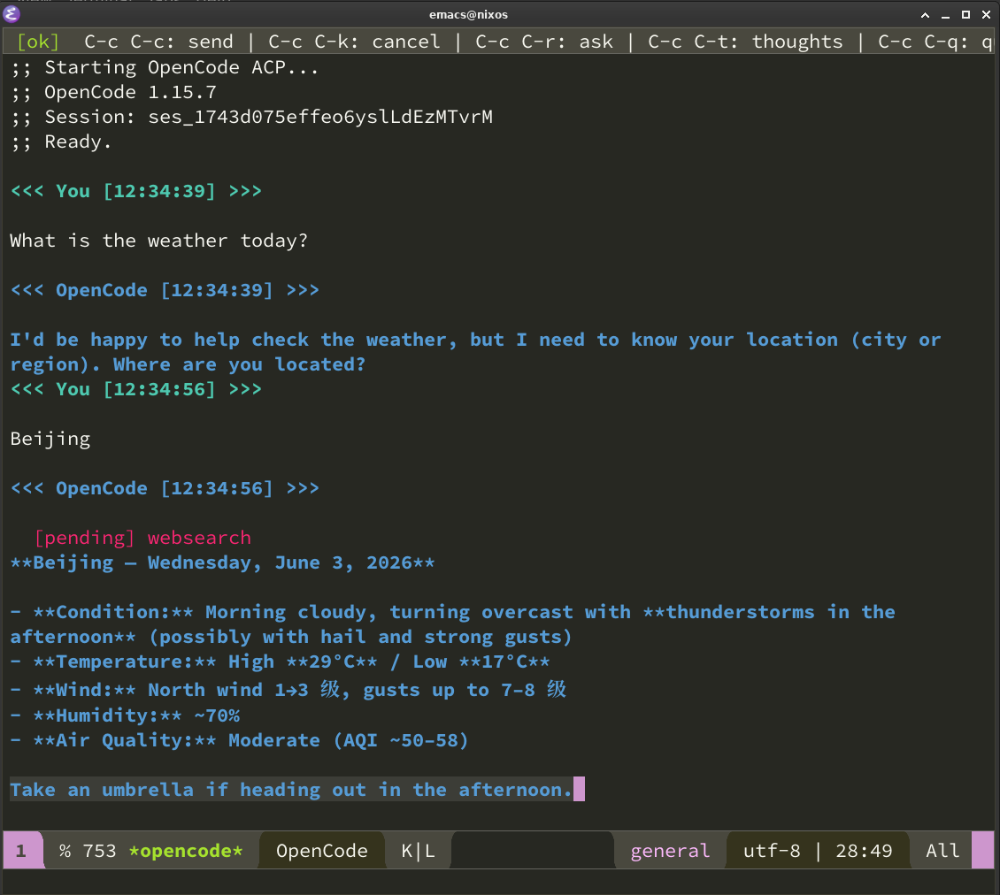

# opencode.el — Emacs Integration for OpenCode

[](LICENSE)

🔤[English Version](README.md)

opencode.el 是一个 Emacs 包，通过 **ACP（Agent Client Protocol）** 与 [OpenCode](https://opencode.ai) AI 编程代理交互。**没有外部依赖，仅使用 Emacs 内置库。**



## 安装

将 `opencode.el` 添加到 `load-path` 并加载：

```elisp
(require 'opencode)
```

或使用 `use-package`：

```elisp
(use-package opencode
  :load-path "/path/to/opencode.el"
  :bind (("C-c o" . opencode)))
```

## 项目结构

```
opencode.el/
├── opencode.el        # Emacs Lisp 客户端实现（ACP 协议）
├── opencode.el.org    # 文字编程文档（Org Mode，可 tangle 提取代码）
├── ACP.md             # ACP 协议原理讲解
├── PRD.md             # 产品需求文档
├── README.md          # 英文 README
└── README-zh.md       # 本文件
```

## 使用

```elisp
M-x opencode
```

打开 `*opencode*` buffer，输入 prompt 后按 `C-c C-c` 发送，`C-c C-r` 选中区域提问。

### 快捷键

| 快捷键 | 命令 | 说明 |
|--------|------|------|
| `C-c C-c` | `opencode-send-prompt` | 发送 prompt |
| `C-c C-k` | `opencode-cancel` | 取消当前请求 |
| `C-c C-r` | `opencode-ask` | 选中区域并提问 |
| `C-c C-t` | `opencode-toggle-thoughts` | 切换 thinking 显示 |
| `C-c C-l` | `opencode-clear` | 清空 buffer |
| `C-c C-q` | `opencode-quit` | 退出并关闭进程 |

### 自定义

```elisp
(setq opencode-show-thoughts t)  ;; 默认显示 thinking 内容（默认 nil）
(setq opencode-executable "opencode")  ;; 可执行文件路径
```

## 作者

OpenCode + shuiruge@hotmail.com

## 协议

MIT
